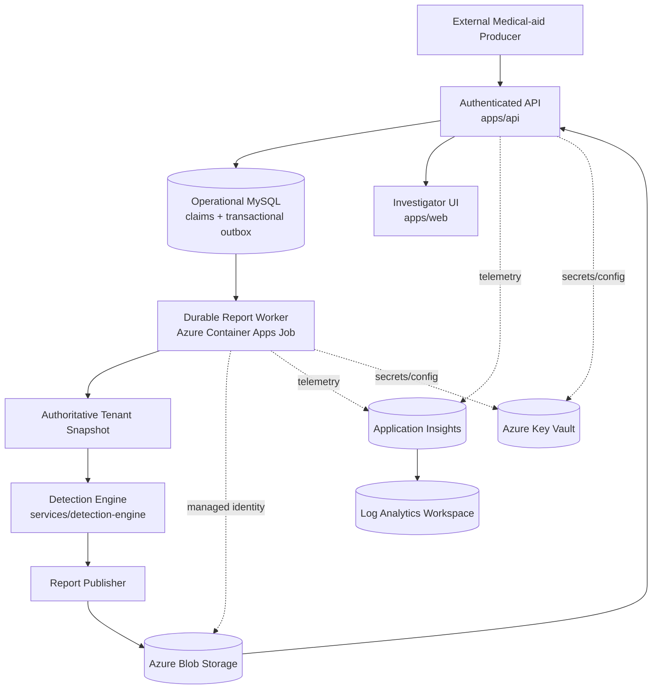
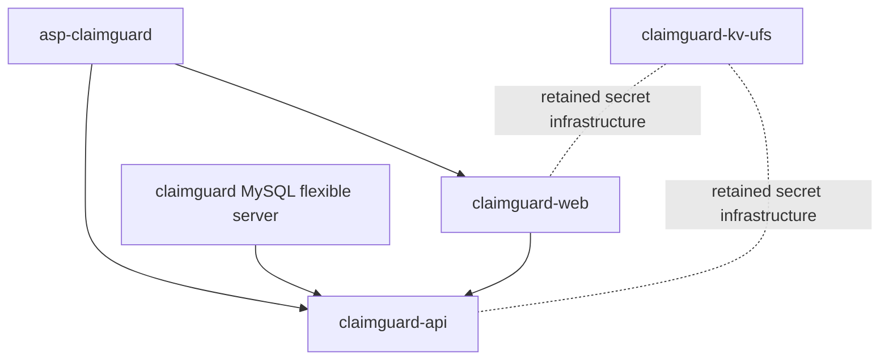

# Azure Production Architecture

## Architecture Overview

ClaimGuard is a personal Azure-hosted Node.js application composed of a production API and production web frontend running on a shared Linux App Service plan. The active production deployment targets are `claimguard-api` and `claimguard-web`. The obsolete `-ufs` App Services were removed after validation. `claimguard-kv-ufs` remains in place as the production Key Vault.

The platform architecture is now centered on a strict producer/consumer boundary:

- The detection engine is the only fraud-analysis component.
- The report producer runtime orchestrates runs and publishes report artifacts.
- The API is a read-only report consumer.
- The investigator UI consumes only API endpoints.

## Target Azure-Native Producer/Consumer Topology

## Component Responsibilities

### Detection Engine (`services/detection-engine`)

- Analyzes authoritative tenant snapshots and executes fraud detection logic.
- Produces report payloads as domain output.
- Does not host API routes.

### Report Producer (`services/report-producer`)

- Leases durable claim-ingestion outbox jobs and coalesces work by tenant.
- Invokes the detection engine.
- Publishes versioned report artifacts, metadata, and latest pointer.
- Implements retries and runtime telemetry hooks.

### API (`apps/api`)

- Reads the latest published report through `ReportStorage` abstraction.
- Exposes read-only investigator endpoints:
  - `GET /detection/report`
  - `GET /detection/graph`
  - `GET /detection/risk`
- Does not expose an ad hoc detection execution endpoint.

### Investigator UI (`apps/web`)

- Consumes API endpoints only.
- Contains no fraud detection logic and performs no report generation.

## Execution Flow

1. An external producer submits an authenticated, bounded ingestion batch.
2. The API commits reference data, claims, and an outbox job atomically.
3. The report worker leases work and reloads the complete tenant snapshot.
4. The worker invokes the detection engine and publishes report metadata to Blob Storage.
5. The worker updates the tenant-scoped latest pointer atomically and completes the outbox job.
6. The API reads the latest report through `ReportStorage`; the UI uses read-only detection endpoints.

## Storage Contract

Blob container stores:

- `<tenant-id>/latest.json` (latest pointer)
- `<tenant-id>/reports/report-<version>.json` (immutable versioned payload)
- `<tenant-id>/metadata/metadata-<version>.json` (run metadata)

## Deployment Flow

1. Deploy API and web to App Service.
2. Deploy producer runtime to Azure Container Apps Job.
3. Configure managed identities for API and producer.
4. Grant Blob data-plane access via RBAC.
5. Store non-identity configuration in Key Vault and app settings references.

## Extension Points

- Queue triggers: Azure Service Bus -> producer runtime.
- Scheduling: ACA Job schedules.
- Graph persistence: publish downstream graph/evidence artifacts after report publish.
- Ledger persistence: API remains read-only; ledger writes handled by dedicated workflow components.

The current production architecture is intentionally small:

- `claimguard-api` serves the backend API.
- `claimguard-web` serves the frontend and calls the production API.
- `claimguard` stores application data in Azure Database for MySQL Flexible Server.
- `asp-claimguard` hosts both production App Services.
- `claimguard-kv-ufs` holds Key Vault-backed secret infrastructure and remains retained.

## Resource Inventory

### Remaining Azure Resources

| Resource | Type | Purpose |
| --- | --- | --- |
| `claimguard` | `Microsoft.DBforMySQL/flexibleServers` | Production relational database for the API |
| `asp-claimguard` | `Microsoft.Web/serverFarms` | Shared Linux App Service plan for API and web |
| `claimguard-kv-ufs` | `Microsoft.KeyVault/vaults` | Production Key Vault retained for secret infrastructure |
| `claimguard-api` | `Microsoft.Web/sites` | Canonical production API |
| `claimguard-web` | `Microsoft.Web/sites` | Canonical production frontend |

### Removed Obsolete Resources

- `claimguard-api-ufs`
- `claimguard-web-ufs`

## Dependency Graph

## Deployment Architecture

The production API uses ZipDeploy-style extraction into `/home/site/wwwroot` with no build automation during deployment:

- `claimguard-api` deployment history shows `Push-Deployer` and `OneDeploy` entries.
- The detailed Kudu deployment log for the successful deployment records `ZipDeploy` extraction and `Rsync completed to /home/site/wwwroot`.
- `SCM_DO_BUILD_DURING_DEPLOYMENT=false` on the API.

The production web app uses OneDeploy and has build-on-deploy enabled:

- `claimguard-web` deployment history shows `OneDeploy` entries.
- `SCM_DO_BUILD_DURING_DEPLOYMENT=true` on the web app.

## Startup Commands

| App Service | Startup Command |
| --- | --- |
| `claimguard-api` | `node src/backend-server.js` |
| `claimguard-web` | `node src/server.js` |

## Deployment History Summary

### `claimguard-api`

- Latest deployment status: healthy
- Deployment IDs observed: `0fb41989-4287-44e7-a5ec-c0d8a50471be`, `e2624492-2af5-4953-90d1-3689b582c25f`
- Deployment methods observed: `Push-Deployer`, `OneDeploy`
- No errors or warnings in the captured summaries

### `claimguard-web`

- Latest deployment status: healthy
- Deployment IDs observed: `b547cb86-a9f5-4873-a44a-fabab759dbcc`, `e6c72028-d4d0-4eec-84d6-39abc50d4f35`, `c3ab86c0-477d-43c3-aa37-21055fbd206b`
- Deployment method observed: `OneDeploy`
- No errors or warnings in the captured summaries

## Environment Variables

### `claimguard-api`

| Variable | Value |
| --- | --- |
| `MYSQL_URL` | redacted |
| `SENTRY_DSN_API` | redacted |
| `NEW_RELIC_LICENSE_KEY` | redacted |
| `NEW_RELIC_APP_NAME` | `ClaimGuard` |
| `NODE_ENV` | `production` |
| `COSMOSDB_CONNECTION_STRING` | redacted |
| `REPORT_STORAGE_BACKEND` | `azure_blob` |
| `REPORT_STORAGE_CONTAINER` | `claimguard-reports` |
| `REPORT_STORAGE_ACCOUNT_URL` | `https://<storage-account>.blob.core.windows.net` |
| `REPORT_STORAGE_LATEST_POINTER` | `latest.json` |
| `SCM_DO_BUILD_DURING_DEPLOYMENT` | `false` |
| `WEBSITE_HTTPLOGGING_RETENTION_DAYS` | `3` |

### `claimguard-web`

| Variable | Value |
| --- | --- |
| `SENTRY_DSN_WEB` | redacted |
| `NODE_ENV` | `production` |
| `CLAIMGUARD_API_BASE_URL` | `https://claimguard-api.azurewebsites.net` |
| `SCM_DO_BUILD_DURING_DEPLOYMENT` | `true` |

### `claimguard-report-producer` (Container Apps Job)

| Variable | Value |
| --- | --- |
| `REPORT_STORAGE_CONTAINER` | `claimguard-reports` |
| `REPORT_STORAGE_ACCOUNT_URL` | `https://<storage-account>.blob.core.windows.net` |
| `REPORT_STORAGE_LATEST_POINTER` | `latest.json` |
| `CONTROL_PLANE_MYSQL_URL` | redacted |
| `MYSQL_URL` | redacted |
| Active route + `worker_routing_status` | authoritative report-worker organisation discovery |
| Per-route Key Vault role assignments | exact four-secret access for each private tenant route |
| `APPLICATIONINSIGHTS_CONNECTION_STRING` | redacted |

## Production Configuration Summary

### `claimguard-api`

- App Service plan: `asp-claimguard`
- Hostname: `claimguard-api.azurewebsites.net`
- SCM hostname: `claimguard-api.scm.azurewebsites.net`
- Startup command: `node src/backend-server.js`
- Managed identity: none
- App authentication: disabled
- Deployment source: default/source-control metadata only, no active GitHub Action deployment link

### `claimguard-web`

- App Service plan: `asp-claimguard`
- Hostname: `claimguard-web.azurewebsites.net`
- SCM hostname: `claimguard-web.scm.azurewebsites.net`
- Startup command: `node src/server.js`
- Managed identity: none
- App authentication: disabled
- Deployment source: default/source-control metadata only, no active GitHub Action deployment link

### `claimguard-kv-ufs`

- Key Vault RBAC is enabled
- Key Vault is retained by design
- No production deployment path currently depends on it for startup or routing

## Dependency Validation

The following checks were completed after removing the obsolete UFS App Services:

- No Azure Resource Graph matches remained outside the resource group for `claimguard-api-ufs` or `claimguard-web-ufs`.
- No deployment history remained for the deleted UFS apps.
- No deployment slots were present on the deleted UFS apps.
- No custom domains were attached beyond the default Azure hostnames.
- No production app settings changed during deletion.
- The production API and web apps still resolve and remain in the `Running` state.
- The App Service plan remains `Ready` and continues hosting the two production apps.

## Unused / Orphaned Items

- No unused production app settings were identified on `claimguard-api` or `claimguard-web`.
- No deployment slots exist for the production apps.
- No custom domains are attached to the production apps beyond the default Azure hostnames.
- No managed identity is assigned to `claimguard-api`; `claimguard-web` also has no managed identity assigned.
- No Azure Resource Graph references remain outside the resource group for the deleted UFS apps.
- The retained Key Vault `claimguard-kv-ufs` still contains two role assignments whose principals no longer exist in Entra ID:
  - `Key Vault Secrets User` for principalId `2fde62f3-c77e-4c81-b6f7-736eb38acf78`
  - `Key Vault Secrets User` for principalId `355c1273-d2ac-4ba6-afb5-228e5f003b14`
- Those RBAC assignments are orphaned and should be reviewed later if the Key Vault is ever migrated away from the retained suffix.

## Disaster Recovery Procedure

1. Recreate the production App Service from the documented startup command and current configuration.
2. Restore the MySQL backup if data loss occurred.
3. Reapply `MYSQL_URL`, `SENTRY_DSN_API`, `NEW_RELIC_LICENSE_KEY`, `NODE_ENV`, `COSMOSDB_CONNECTION_STRING`, `REPORT_STORAGE_BACKEND`, `REPORT_STORAGE_CONTAINER`, `REPORT_STORAGE_ACCOUNT_URL`, and `REPORT_STORAGE_LATEST_POINTER` to the API.
4. Reapply `SENTRY_DSN_WEB`, `NODE_ENV`, and `CLAIMGUARD_API_BASE_URL` to the web app.
5. Reapply producer runtime settings (`REPORT_STORAGE_CONTAINER`, `REPORT_STORAGE_ACCOUNT_URL`, and telemetry settings) to Azure Container Apps Job.
6. Verify both apps resolve on their default Azure hostnames.
7. Confirm API and producer runtime logs are healthy before restoring traffic.

## Deployment Checklist

- Confirm `claimguard-api` is `Running`.
- Confirm `claimguard-web` is `Running`.
- Confirm producer job image revision is healthy in Azure Container Apps.
- Confirm `CLAIMGUARD_API_BASE_URL` points to `https://claimguard-api.azurewebsites.net`.
- Confirm the API uses `node src/backend-server.js`.
- Confirm the web app uses `node src/server.js`.
- Confirm the App Service plan is `asp-claimguard`.
- Confirm no deleted UFS app names reappear in deployment scripts or workflow files.

## Operations Checklist

- Monitor API deployment history for new `Push-Deployer` or `OneDeploy` activity.
- Review API and web app settings after any future secret rotation.
- Keep deployment targets on the non-UFS hostnames only.
- Recheck Key Vault access if secret delivery is reintroduced.
- Avoid reintroducing UFS-named resources into production paths.

## Infrastructure Maintenance Notes

- `claimguard-kv-ufs` is retained intentionally and should not be deleted without a secret migration plan.
- The current production topology is minimal and uses a single shared App Service plan.
- No extra network resources, slots, or front-door layers are currently deployed.
- The deployment surface is small enough that changes should be reviewed against the live Azure configuration before any future cleanup.
- The remaining Key Vault RBAC entries tied to deleted UFS principals are the only clearly orphaned access artifacts observed after cleanup.

## Remaining Technical Debt

- GitHub repository secrets and environment secrets could not be independently enumerated from this workspace because GitHub CLI access was unavailable.
- `claimguard-kv-ufs` still carries the UFS suffix even though it is now retained as production Key Vault infrastructure.
- The solution still uses raw app settings for database and observability configuration instead of a fully centralized secret strategy.

## Future Infrastructure Recommendations

- Rename or replace `claimguard-kv-ufs` when a safe secret migration window exists.
- Centralize production configuration into a cleaner secret boundary and rotate out any legacy UFS naming.
- Add a documented app-settings baseline for the production API and web apps.
- Keep the production target names fixed to `claimguard-api` and `claimguard-web`.
- Consider adding automated drift checks for App Service hostnames, app settings, and deployment sources.

## Phase 4 Completion Report

- Infrastructure investigation completed.
- Deployment integrity verified.
- Production deployment path verified.
- Duplicate UFS App Services removed.
- Remaining Azure resource inventory documented.
- Outstanding items: GitHub secrets could not be directly enumerated in this environment.
- Risks: the retained `claimguard-kv-ufs` name may cause future confusion, but it does not affect current deployment.
- Phase 4 objectives have been satisfied.

## CHANGELOG Entry

- Completed the Azure infrastructure investigation and documented the final production architecture.
- Verified the production deployment path and confirmed the canonical targets are `claimguard-api` and `claimguard-web`.
- Removed the obsolete `-ufs` App Services and validated that production remained unchanged.
- Documented the remaining Azure production resources and operational guidance.
- Closed Phase 4.
