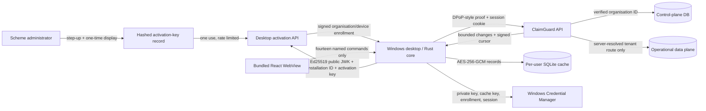

# Sequrin Desktop Architecture

## Scope

`apps/desktop` is a Windows-first Tauri 2 client. It reuses the existing React/Tailwind tokens and shared UI components but has a separate entry point and authentication experience. The existing browser application and routes remain supported.

The desktop is a universal application. Organisation identity comes only from a signed device enrollment; there is no per-scheme binary, editable tenant slug, database selector, or API-origin selector.

The desktop is distributed to medical-scheme organisations. Scheme administrators are valid desktop users for their enrolled scheme, subject to the same server-authorised operational permissions as any other user. ClaimGuard platform administrators are web-only identities and are rejected by desktop authentication. Device-fleet management remains on the web: the desktop has no role-management, activation-key issuance, device-policy, fleet-revocation, audit-management, or platform-governance surface. Its reset command is local recovery that deletes this Windows user's cache and enrollment; re-enrollment still requires a key issued from the Sequrin web application.

## Trust and Data Flow

The WebView has `connect-src 'none'` and no Tauri HTTP, filesystem, shell, process, or updater permission. It can invoke only:

- `desktop_status`
- `activate_desktop`
- `desktop_login`
- `desktop_logout`
- `lock_desktop`
- `synchronize_desktop`
- `desktop_claim_details`
- `desktop_investigators`
- `desktop_create_investigation`
- `desktop_investigation_details`
- `desktop_update_investigation`
- `desktop_add_investigation_note`
- `desktop_upload_investigation_evidence`
- `reset_desktop`

All network access, proof creation, enrollment verification, cache encryption, and secret storage happen in Rust. Connected investigation writes send the last authoritative claim or investigation integer record version as `If-Match`. Rust independently checks the capability required for creation, assignment, status or priority changes, notes, and evidence before issuing a request.

## Organisation Boundary

The server signs `organisationId`, display name, canonical slug, device enrollment ID, permitted API origin, environment, licence expiry, offline-grace expiry, signing key ID/version, and the device public-key thumbprint. The desktop pins the enrollment-signing public JWK and activation origin at compile time.

Every enrolled request has an Ed25519 proof over:

- device enrollment ID;
- `iat` and unique `jti`;
- HTTP method;
- fixed origin plus path (not caller-supplied routing data);
- SHA-256 request-body digest.

The API consumes each proof nonce once, checks enrollment status and expiry, and requires device, authenticated user, and resolved data-plane organisation IDs to match before operational reads. Query/header organisation, tenant, and origin overrides are rejected.

## Storage Boundary

The SQLite file is in Tauri's per-Windows-user local app-data directory. Record IDs are SHA-256-derived lookup keys; JSON record bodies and sync metadata are AES-256-GCM ciphertext with random nonces and organisation/resource/version AAD. The AES key, Ed25519 private seed, signed enrollment, installation ID, session cookie, and minimum session capability profile are stored separately through the OS-native keyring (Windows Credential Manager).

Evidence content is validated and hashed by the API, then written to a private Azure Blob container under an immutable tenant/investigation/evidence key. The operational database stores the content type, byte size, SHA-256 digest, and private object key; clients receive integrity metadata but no public blob URL or storage credential.

This is record-level authenticated encryption, not full-database page encryption. SQLite table names, resource types, encrypted record counts, versions, and update timestamps remain metadata. Use BitLocker/device encryption to protect the full volume, swap/pagefile, and filesystem metadata at rest.

The cache fails closed on an organisation/device binding mismatch, failed SQLite integrity check, invalid nonce, authentication-tag failure, malformed enrollment, expired licence, or expired offline grace.

When offline grace has expired, the cache stays locked but device-bound user authentication remains available online. A successful login revalidates the active device, returns a newly signed grace window for the same immutable organisation/device pair, and only then unlocks the cache. A revoked or expired device cannot renew.

When the server rejects the desktop session with `ACCESS_AUTHORIZATION_VERSION_STALE`, the desktop fails closed to a locked reauthentication state. The user sees a stale-authority message, the cached organisation binding remains fixed, and the workstation requires a fresh sign-in before any capability-driven workspace is reopened. The desktop does not silently downgrade authority, replay a stale mutation, or keep using the superseded capability profile.

## Configuration

API runtime settings are an all-or-none group. If none are present, the web application remains operational and desktop activation returns unavailable. Partial configuration fails API startup.

| Setting | Sensitivity | Purpose |
| --- | --- | --- |
| `DESKTOP_ACTIVATION_KEY_PEPPER` | secret, >=32 bytes | HMAC activation keys before persistence |
| `DESKTOP_ENROLLMENT_SIGNING_PRIVATE_KEY` | secret, Ed25519 | sign enrollment documents |
| `DESKTOP_ENROLLMENT_SIGNING_KEY_ID` | config | enrollment key/version selector |
| `DESKTOP_SYNC_CURSOR_SECRET` | secret, >=32 bytes | sign opaque sync cursors |
| `DESKTOP_API_ORIGIN` | config, HTTPS | permitted enrolled API origin |
| `DESKTOP_ENROLLMENT_LIFETIME_DAYS` | config, optional | licence document lifetime, default 365 |
| `DESKTOP_PROOF_MAXIMUM_CLOCK_SKEW_SECONDS` | config, optional | proof clock skew, default 300 |
| `DESKTOP_SYNC_CURSOR_LIFETIME_DAYS` | config, optional | cursor lifetime, default 30 |
| `DESKTOP_CACHE_RETENTION_DAYS` | config, optional | claim update window, default 90 |

Evidence uploads are enabled only when these API settings are present:

| Setting | Sensitivity | Purpose |
| --- | --- | --- |
| `EVIDENCE_STORAGE_BACKEND` | config | must be `azure_blob` when configured |
| `EVIDENCE_STORAGE_ACCOUNT_URL` | config | Azure Blob account URL; falls back to `REPORT_STORAGE_ACCOUNT_URL` |
| `EVIDENCE_STORAGE_CONTAINER` | config | private evidence container name |

Desktop compile-time settings:

| Setting | Sensitivity | Purpose |
| --- | --- | --- |
| `CLAIMGUARD_ACTIVATION_ORIGIN` | public config | immutable activation/API origin |
| `CLAIMGUARD_ENROLLMENT_VERIFYING_JWK` | public key | verify organisation/device enrollment |
| Tauri updater `pubkey` | public key | verify update payload signatures |

The corresponding private keys are never compiled into the application.

## Permission Model

`desktop.devices.manage` is used only by the browser application and its API boundary; it is never exposed as a Tauri command. Scheme administrators can use the Windows client for their enrolled medical scheme and remain hard-bound to that organisation. Platform administrators manage platform/enrollment metadata on the web, are rejected as desktop users, and do not gain operational claim access. Issuance and revocation require recent password reauthentication plus an exact typed confirmation; raw keys are shown once and never returned by list APIs.

Desktop navigation and controls are capability driven. `investigations.view` enables the investigation queue and encrypted on-demand case detail. `investigations.create`, `investigations.assign`, `investigations.update_status`, `investigations.change_priority`, `investigations.add_note`, and `investigations.upload_evidence` independently enable their corresponding connected-only controls. Each write has an explicit integer-version optimistic-concurrency contract, and assignment is limited to active investigators in the enrolled organisation. Rust rechecks capabilities before returning records or issuing mutations through IPC, which prevents a lower-privileged scheme account using the same Windows profile from inheriting prior authority. Final fraud confirmation and reversal remain web-only workflows.

See [desktop-sync-protocol.md](desktop-sync-protocol.md), [desktop-cache-retention.md](desktop-cache-retention.md), and [desktop-security-and-threat-model.md](desktop-security-and-threat-model.md).
