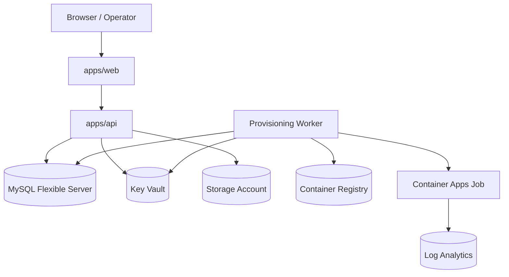

# ClaimGuard Production-Shaped Architecture

ClaimGuard is production-shaped but not formally production-ready. This document captures the technical boundaries that are now in place or intentionally required by Phase 12, and it distinguishes them from the later qualification gates needed before any production-readiness claim.

## State Definitions

### Production-shaped

ClaimGuard has production-grade technical boundaries and controls, including:

- environment separation;
- tenant isolation;
- secure authentication and sessions;
- centralized secret governance;
- managed identities where Azure workloads require them;
- least privilege;
- secure deployment;
- observability;
- audit foundations;
- backups and restore procedures;
- incident runbooks;
- rate limiting and abuse controls;
- bounded resource usage;
- security testing;
- dependency and supply-chain controls;
- data-retention and privacy-control foundations;
- documented operational ownership.

### Formally production-ready

ClaimGuard may only be called production-ready after later qualification evidence exists for:

- approved threat model;
- privacy and POPIA assessment;
- external penetration test;
- remediation verification;
- backup restore exercise;
- disaster-recovery exercise;
- load and capacity test;
- availability and SLO evidence;
- incident-response exercise;
- access review;
- data-retention approval;
- vulnerability-management process;
- operational support ownership;
- legal, contractual, and governance sign-off.

This phase creates the technical foundation and the qualification plan. It does not complete those later gates.

## Current Live Azure Shape

### Confirmed subscription

- Subscription: Azure for Students
- Subscription ID: `896d3c72-d979-4bdc-a37f-060988d12032`
- Tenant ID: `8efc1bb9-b90f-4a48-bf6c-ba0686193b80`
- Resource group: `ClaimGuard`

### Confirmed Azure resources in `ClaimGuard`

- `claimguard` - Azure Database for MySQL Flexible Server
- `asp-claimguard` - App Service plan
- `claimguard-kv-ufs` - Azure Key Vault
- `claimguard-api` - App Service API
- `claimguard-web` - App Service web frontend
- `cgrpt0715sa` - Storage account
- `claimguardacr11e` - Container Registry
- `claimguard-env-11e` - Container Apps environment
- `claimguard-provisioning-worker` - Container Apps job
- `claimguard-provisioner-identity` - user-assigned managed identity
- `oidc-msi-9e84` - user-assigned managed identity
- `oidc-msi-a3e5` - user-assigned managed identity
- `claimguard-logs-11e` - Log Analytics workspace

### Current public-network posture

- API and web App Services are publicly reachable.
- Both App Services have `httpsOnly=false` in live Azure.
- Both App Services have SCM endpoints enabled and publicly reachable.
- MySQL Flexible Server has public network access enabled.
- Key Vault public network access is enabled.
- Storage account has public blob access disabled, HTTPS only enabled, and no managed identity assigned.
- The provisioning worker uses a user-assigned managed identity.

## Runtime Topology

## Verified Runtime Commands

### API

- Start: `node src/backend-server.js`
- Health: `GET /health`
- Liveness: `GET /live`
- Readiness: `GET /ready`

### Web

- Start: `node src/server.js`
- Root: `GET /`

## Architecture Boundaries

- The API owns authenticated data access and read-only investigator endpoints.
- The web app is a presentation shell and proxy boundary.
- The provisioning worker owns provisioning operations and should remain separate from browser-facing code.
- Future Scenario Lab ingestion remains out of scope for this phase.
- Phase 11F data cutover does not begin in this phase.

## Notable Gaps Still Requiring Qualification

- Production-readiness evidence is incomplete.
- Key Vault and App Service secret delivery are not yet fully normalized to a single governed path.
- MySQL, App Service, and Key Vault are still publicly reachable.
- Formal backup restore, DR, and incident-response exercises are not yet evidenced here.
- A live secret inventory exists in App Service settings and must be governed carefully before any migration.
